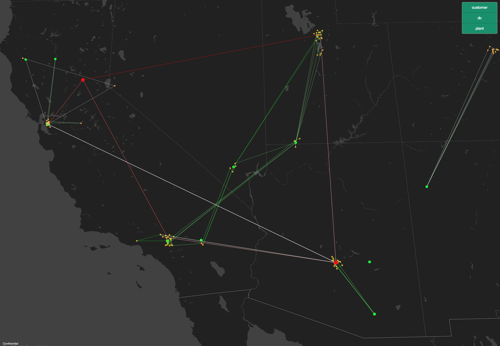

# MapBoxWrapper
A python wrapper for plotting latitude/longitude coordinates in Mapbox to produce an initial html.

The standard map produced is shown below: 



The goal is only to produce an concise html to give you a headstart to creating anything more
complicated if need be.

Familiarity with mapbox will help understanding the class attributes.

## Usage

```python2html
import mapboxwrapper as mbc
from colour import Color

OUTPUT_PATH = Path("...")

mw = mbc.MapBoxWrapper() # initialise class

all_features = []

all_features += [{'id_':'clearai',
    'geojson_type': 'Point',
    'colour': Color("orange").get_hex(),
    'properties': {'node':'work', 'circle-radius':3, 'kind':'start'},
    'array': [-0.156545, 51.521277]}]
    
all_features += [{'id_':'food_unhealthy',
    'geojson_type': 'MultiPoint',
    'colour': Color("red").get_hex(),
    'properties': {'node':'food', 'circle-radius':3, 'kind':'unhealthy'},
    'array': [[ -0.157495, 51.521291], [-0.157530, 51.521819]]}]
    
all_features += [{'id_':'food_healthy',
    'geojson_type': 'MultiPoint',
    'colour': Color("lime").get_hex(),
    'properties': {'node':'food', 'circle-radius':3, 'kind':'healthy'},
    'array': [[-0.157240, 51.520970], [-0.156198, 51.520970]]}]

all_features += [{'id_':'healthy_food_directions',
    'geojson_type': 'MultiLineString',
    'colour': Color("white").get_hex(),
    'properties': {'node':'path', 'kind':'healthy'},
    'array': [[[-0.157240, 51.520970], [-0.156545, 51.521277]],
              [[-0.156198, 51.520970], [-0.156545, 51.521277]]]   
              }]

all_features += [{'id_':'unhealthy_food_directions',
    'geojson_type': 'MultiLineString',
    'colour': Color("red").get_hex(),
    'properties': {'node':'path', 'kind':'unhealthy'},
    'array': [[[ -0.157495, 51.521291], [-0.156545, 51.521277]],
              [[-0.157530, 51.521819], [-0.156545, 51.521277]]]   
              }]

for feat in all_features:
    mw.add_feature(feat)

mw.output_html(OUTPUT_PATH / "mapbox_test.html",
    layer_property="node",
    filters=['any',['==', 'kind', 'healthy'], ['==', 'kind', 'start']])
```
